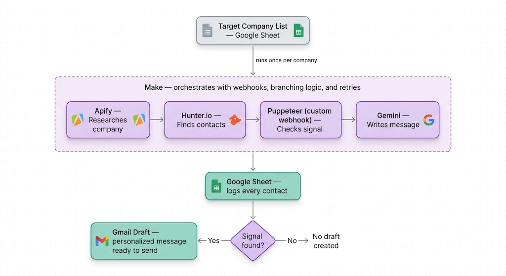
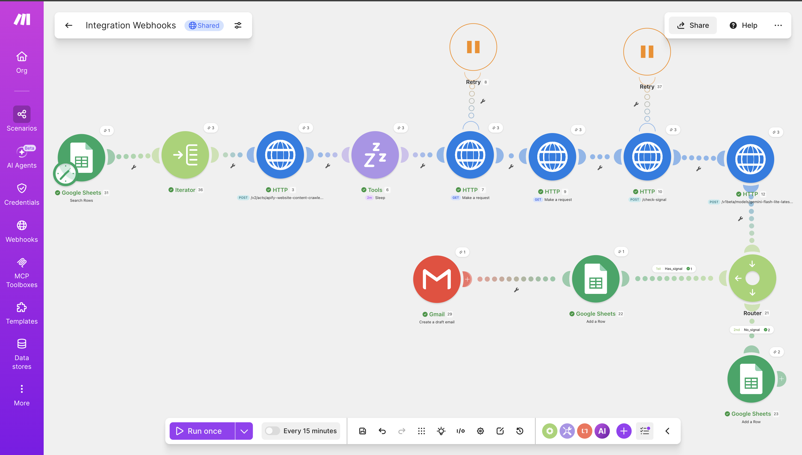

# Job Search Outreach Stack

An automated outreach pipeline for my own job search. Reads a list of target
companies, and for each one: Apify scrapes their site, Hunter.io finds a real
contact, a Puppeteer service I built and deployed checks whether they're
hiring for a role matching my background, and Gemini writes a personalized
outreach message. Make.com orchestrates all of it — reading the company
list, looping through it, branching based on whether a real hiring signal
was found, and retrying failed steps automatically.

Target roles: Product Analyst, Technical Business Analyst, AI/ML Business
Analyst, Systems Analyst, and GTM Engineer.



## Demo

🎥 [Watch the full walkthrough](https://www.loom.com/share/3116d0ed2e0f4cdfb9a61f83eb53f09f)



## How it works

1. **Google Sheets (Search Rows)** reads a "Target Companies" tab — Name,
   Domain, Category columns, one row per company.
2. **Iterator** splits that list so every step after this point runs once
   per company automatically. Nothing is hardcoded to a single company.
3. **Apify** starts a web crawl of the company's site. The crawl itself can
   take over a minute, longer than Make's 40-second HTTP timeout, so this is
   split into two calls: one starts the job and returns immediately, a
   **Sleep** step waits, then a second call fetches the actual results. A
   **Retry** handler is attached in case the call fails transiently.
4. **Hunter.io** finds a real contact at that company — name, title, and a
   verified email.
5. **Puppeteer**, running as a webhook I built and deployed myself (see
   `webhook-server/`), checks the company's careers page for an opening
   matching my target roles and returns a true/false signal plus which
   keyword matched. Also has a retry attached, since a slow-loading site can
   occasionally exceed the timeout.
6. **Gemini** writes a personalized outreach email referencing the real
   signal (or falling back to general context if there wasn't one).
7. **Make Router** branches on whether a signal was found:
   - **Every contact** gets logged to a Google Sheet regardless of outcome.
   - **Only if a real signal was found**, a ready-to-send Gmail draft also
     gets created — no outreach gets drafted on a weak/no signal.

## Why this architecture

Two tools do discovery/scraping (Apify, Puppeteer) and one does data
enrichment (Hunter.io) because that's the real division of labor in outbound
tooling: scrapers are good at reading pages, data providers are good at
verified contact info, and no single tool does both well. Gemini turns the
combined data into a short, specific outreach email introducing me as a
candidate. Make.com is the actual orchestration layer running all of this —
not a planned future step, the scenario described above is live and tested
end-to-end across multiple real companies.

**Note on tool swaps:** this originally used Apollo and Claude. Apollo's
Search API turned out to be gated entirely behind a paid plan (a hard 403
even with unused credits sitting on a free account — credits and API access
are separate entitlements there), so I swapped to Hunter.io, which has a
genuinely free tier with real API access. The same cost/access reasoning led
to swapping Claude for Gemini. Both swaps are functionally identical roles
in the pipeline, just different vendors.

## Repo layout
The `src/` and `puppeteer/` local scripts were the original dev/testing
version of this pipeline (single company, run manually from the terminal).
The live, production version is the Make.com scenario described above,
which loops through multiple companies automatically and calls the deployed
`webhook-server/` instead of running Puppeteer locally.

## Setup

### Local Python/Node pipeline (for development/testing)

1. `pip install -r requirements.txt --break-system-packages`
2. `cd puppeteer && npm install`
3. Copy `config/.env.example` to `.env` and fill in your real keys:
   - `APIFY_TOKEN` — https://console.apify.com/account/integrations
   - `HUNTER_API_KEY` — https://hunter.io/api-keys (free forever plan, no card required)
   - `GEMINI_API_KEY` — https://aistudio.google.com/apikey
4. For the Google Sheet output: create a Google Cloud service account with
   Sheets API enabled, download the JSON key, set
   `GOOGLE_SERVICE_ACCOUNT_JSON` to its path, and share your target Sheet
   with the service account's email.
5. For Gmail drafts: create an OAuth client in Google Cloud Console (Desktop
   app type), download as `config/credentials.json`. First run opens a
   browser to authorize.
6. Load your `.env`: `set -a && source .env && set +a`

### Deployed webhook (Puppeteer signal check)

1. Deploy `webhook-server/` to a host that can run headless Chrome — this was
   built and tested on Render's free tier.
   - Root directory: `webhook-server`
   - Build command: `npm install`
   - Start command: `npm start`
   - Environment variable: `WEBHOOK_SECRET` — any random string you generate,
     used to authenticate calls to the endpoint
2. Test it directly:
```bash
   curl -X POST https://YOUR-DEPLOY-URL/check-signal \
     -H "Content-Type: application/json" \
     -H "x-webhook-secret: YOUR_SECRET" \
     -d '{"name": "Example Co", "domain": "example.com"}'
```

### Make.com scenario (production orchestration)

See `make_scenario_blueprint.md` for the full module-by-module breakdown.
Summary: Google Sheets (Search Rows) → Iterator → Apify (start + fetch, with
Retry) → Hunter.io → deployed webhook (with Retry) → Gemini → Router →
Google Sheets (Add a Row) + Gmail (Create Draft, signal-only branch).

## A few known limitations

- The signal check only reads what's on the careers page at load time —
  companies with heavily paginated job boards (10+ pages of listings) may
  show a false negative if the matching role isn't on the first page or two.
- Very JS-heavy career pages (large embedded job boards, many third-party
  trackers) can occasionally push past the 40-second timeout even with
  retries; a handful of companies were excluded from testing for this reason.
- Free-tier hosting (Render) cold-starts after ~15 minutes of inactivity,
  adding up to ~50 seconds to the first call after a gap.
